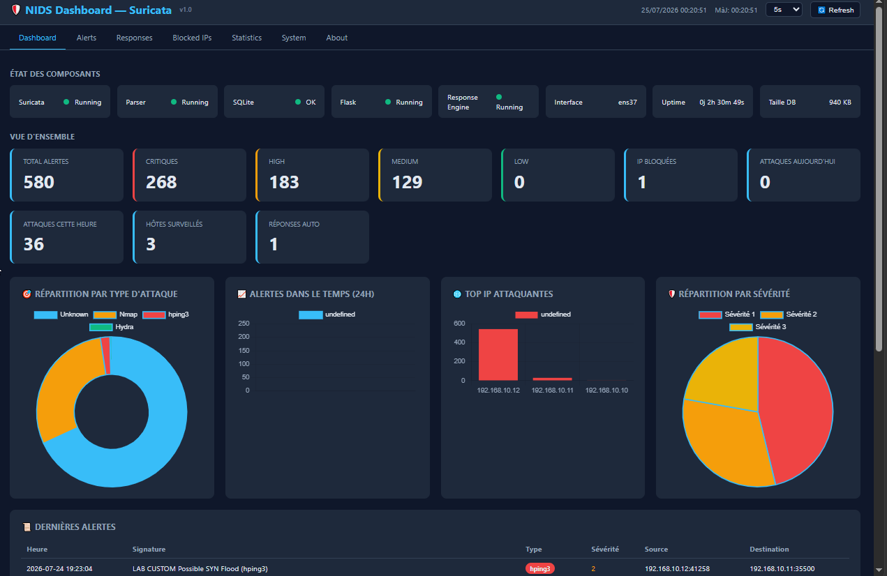
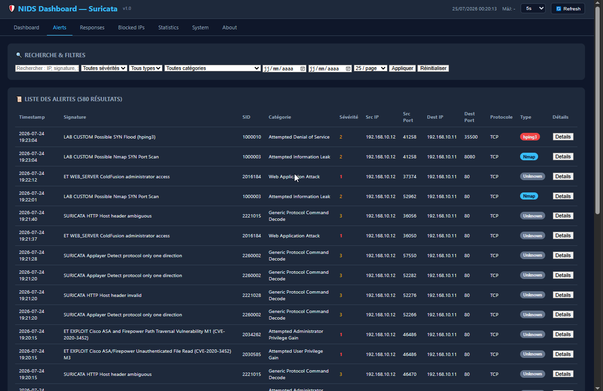
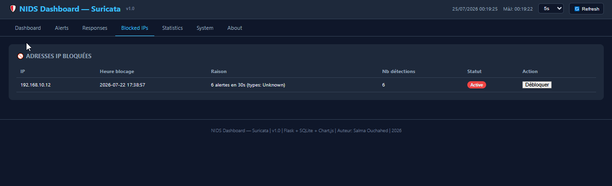

# CodeAlpha--Network-Intrusion-Detection-System

<div align="center">

# 🛡️ NIDS Dashboard

### Network Intrusion Detection System powered by Suricata

Real-time network intrusion detection pipeline — capture, analysis,
visualization, and automated threat response.

[](https://www.python.org/)
[](https://flask.palletsprojects.com/)
[](https://suricata.io/)
[](https://www.sqlite.org/)
[](#-license)

[Overview](#-overview) •
[Screenshots](#-screenshots) •
[Architecture](#️-architecture) •
[Installation](#️-installation) •
[Usage](#️-usage)

</div>

---

## 📌 Table of Contents

- [Overview](#-overview)
- [Screenshots](#-screenshots)
- [Architecture](#️-architecture)
- [Lab Topology](#-lab-topology)
- [Features](#-features)
- [Tech Stack](#-tech-stack)
- [Repository Structure](#-repository-structure)
- [Installation](#️-installation)
- [Usage](#️-usage)
- [Custom Suricata Rules](#-custom-suricata-rules)
- [Database Schema](#-database-schema)
- [Known Limitations / Future Work](#-known-limitations--future-work)
- [Author](#-author)
- [License](#-license)

---

## 🔍 Overview

This project implements a complete network intrusion detection and response
pipeline:

1. **Suricata** captures network traffic in real time and generates
   structured alerts (`eve.json`) based on standard rulesets (ET Open) and
   custom rules targeting common attack tools (Nmap, Hydra, Nikto, hping3).
2. A **Python Parser** continuously reads this stream and feeds a **SQLite**
   database.
3. A **Flask Dashboard** queries this database to provide real-time
   visualization (KPIs, Chart.js graphs, search, filters).
4. A **Response Engine**, fully independent from the dashboard, monitors the
   database and triggers automated responses (IP blocking, logging) once an
   alert threshold is exceeded.

> 💡 Project built as part of a cybersecurity lab — **TASK 4: Network
> Intrusion Detection System**.

---

## 📸 Screenshots

<div align="center">

### Main Dashboard
Real-time overview: component status, KPIs, activity charts.



<br><br>

### Live Alerts
Live search, combinable filters (severity, type, category, dates), full JSON detail per alert.



<br><br>

<table>
<tr>
<td width="50%">

**Advanced Statistics**
Top ports, protocols, categories, daily trends.


</td>
<td width="50%">

**Blocked IPs**
History of automated blocks and manual unblocking.



</td>
</tr>
</table>

</div>

> 📁 All screenshots live in [`docs/screenshots/`](docs/screenshots/).
> See the checklist below if you're adding your own.

<details>
<summary><strong>How to add your own screenshots</strong></summary>

```bash
mkdir -p docs/screenshots
# drop your .png files in this folder using these exact names:
#   dashboard.png
#   alerts.png
#   statistics.png
#   blocked-ips.png
git add docs/screenshots/*.png
git commit -m "docs: add dashboard screenshots"
```

Tip: resize screenshots to ~1600px max width before committing (keeps the
repo lighter and GitHub renders faster).

</details>

---

## 🏗️ Architecture

```
                    ┌─────────────────────┐
                    │   Suricata (IDS)     │
                    │   → eve.json         │
                    └──────────┬──────────┘
                               │
                               ▼
                    ┌─────────────────────┐
                    │   Python Parser      │
                    │   (streaming reader) │
                    └──────────┬──────────┘
                               │
                               ▼
                    ┌─────────────────────┐
                    │  SQLite (alerts.db)  │
                    └──────────┬──────────┘
                               │
                ┌──────────────┴──────────────┐
                ▼                             ▼
     ┌─────────────────────┐       ┌─────────────────────┐
     │   Flask Dashboard     │       │   Response Engine    │
     │   (read-only)          │       │   (read + action)     │
     │   Chart.js / REST API │       │   iptables / logs     │
     └─────────────────────┘       └─────────────────────┘
```

**Key principle**: the Dashboard and the Response Engine are two independent
processes that only share read access to the same SQLite database. This
separation prevents a display bug from ever triggering a security action,
and allows each component to restart independently without affecting the
other.

---

## 🖧 Lab Topology

```
                         Windows Host
                              │
                       VMware Workstation
                              │
                       VMnet (Host-Only)
                              │
        ┌─────────────────────┼─────────────────────┐
        ▼                     ▼                     ▼
  Kali Linux           Ubuntu Server           Ubuntu Server
  (Attacker)              (Victim)                 (IDS)
 192.168.10.12          192.168.10.11           192.168.10.10

  Tools:                 Services:                Tools:
  - Nmap                 - Apache2                - Suricata 7.0.3
  - Hydra                - OpenSSH                - Python Parser
  - Nikto                - vsftpd                 - Flask Dashboard
  - hping3               - Test website           - Response Engine
  - curl                                          - EveBox (optional)
```

---

## ✨ Features

### 🎯 Detection (Suricata)
- Standard ET Open rules + 10 custom rules targeting Nmap
  (SYN/NULL/FIN/XMAS scans), Hydra (SSH/FTP brute-force), Nikto, hping3
  (low TTL, SYN flood)
- Live capture on a dedicated network interface

### ⚙️ Processing (Python Parser)
- Streaming reader of `eve.json` (persisted offset, no full re-read)
- Automatic attack-type resolution via a SID → tool mapping table
- Raw JSON preserved for full audit/detail

### 📊 Visualization (Flask Dashboard)
| Page | Description |
|---|---|
| **Dashboard** | System component status, KPIs, real-time charts |
| **Alerts** | Live search, combinable filters, pagination, JSON detail |
| **Responses** | History of automated Response Engine actions |
| **Blocked IPs** | List of blocked IPs with manual unblock |
| **Statistics** | Top ports, protocols, categories, daily trends |
| **System** | Detailed component status, system log |
| **About** | Project and architecture overview |

Configurable auto-refresh (5s / 10s / 30s).

### 🚨 Automated Response (Response Engine)
- Continuous monitoring of alert thresholds per source IP
- **Dry-run mode by default** (simulation without real blocking, with full
  logging) — a safeguard against self-locking during testing
- Whitelist of protected IPs (e.g. the IDS itself)
- Real blocking via `iptables`, enabled through configuration
- Full decision history in `response_log`

---

## 🛠️ Tech Stack

| Component | Technology |
|---|---|
| IDS engine | Suricata 7.0.3 |
| Processing / Parsing | Python 3.12 |
| Dashboard backend | Flask |
| Database | SQLite |
| Visualization | Chart.js, vanilla HTML/CSS/JS |
| Automated response | Python + iptables |
| Lab environment | VMware Workstation (Kali Linux, Ubuntu Server ×2) |

---

## 📁 Repository Structure

```
nids-dashboard/
├── app.py                     # Flask backend (API routes + pages)
├── parser.py                  # eve.json → SQLite parser
├── response_engine.py         # Automated response engine
├── schema.sql                 # Database schema creation script
├── requirements.txt           # Python dependencies
├── suricata/
│   └── local.rules            # Custom Suricata rules
├── static/
│   ├── css/
│   │   └── style.css          # Shared styles (dark theme)
│   └── js/
│       └── common.js          # Clock, auto-refresh, system status
├── templates/
│   ├── base.html               # Shared layout (header, nav, footer)
│   ├── index.html               # Dashboard page
│   ├── alerts.html              # Alerts page
│   ├── responses.html           # Responses page
│   ├── blocked_ips.html         # Blocked IPs page
│   ├── statistics.html          # Statistics page
│   ├── system.html              # System page
│   └── about.html               # About page
├── docs/
│   └── screenshots/             # Screenshots used in this README
└── README.md
```

---

## ⚙️ Installation

### Prerequisites
- Suricata installed and configured (see [Custom Suricata Rules](#-custom-suricata-rules))
- Python 3.10+
- Read access to `/var/log/suricata/eve.json`

### Steps

```bash
# 1. Clone the repository
git clone https://github.com/<your-account>/nids-dashboard.git
cd nids-dashboard

# 2. Create a virtual environment
python3 -m venv venv
source venv/bin/activate

# 3. Install dependencies
pip install -r requirements.txt

# 4. Initialize the database
sqlite3 alerts.db < schema.sql

# 5. Copy the custom rules into Suricata
sudo cp suricata/local.rules /var/lib/suricata/rules/local.rules
sudo suricata -T -c /etc/suricata/suricata.yaml -v   # validate syntax
sudo systemctl restart suricata
```

### `requirements.txt`

```
flask
```

---

## ▶️ Usage

The system requires **4 processes running simultaneously** (4 terminals, or
a `systemd`/`tmux` service manager in production):

```bash
# Terminal 1 — Suricata (live network capture)
sudo suricata -c /etc/suricata/suricata.yaml -i <interface> -v

# Terminal 2 — Parser (eve.json → SQLite)
python3 parser.py

# Terminal 3 — Response Engine (monitoring + automated responses)
python3 response_engine.py

# Terminal 4 — Flask Dashboard (web interface)
python3 app.py
```

Dashboard access: **`http://<IDS_machine_IP>:5000`**

---

## 🎯 Custom Suricata Rules

File: [`suricata/local.rules`](suricata/local.rules)

| SID | Description | Target Tool |
|---|---|---|
| 1000001 | Nikto User-Agent detection | Nikto |
| 1000002 | Nmap NSE script detection | Nmap |
| 1000003 | Nmap SYN scan | Nmap |
| 1000004 | Nmap NULL scan | Nmap |
| 1000005 | Nmap XMAS scan | Nmap |
| 1000006 | Nmap FIN scan | Nmap |
| 1000007 | SSH brute-force (Hydra) | Hydra |
| 1000008 | FTP brute-force (Hydra) | Hydra |
| 1000009 | Low TTL crafted packet (hping3) | hping3 |
| 1000010 | SYN Flood (hping3) | hping3 |

> 💡 The SID → attack-type mapping is also stored in the database
> (`sid_mapping` table), which allows new rules to be added without
> modifying the Parser's Python code.

---

## 🗄️ Database Schema

```sql
alerts        -- Each parsed Suricata alert (timestamp, signature, IP,
              -- ports, severity, attack type, raw JSON...)

sid_mapping   -- Link between signature_id → attack_type (Nmap, Hydra, Nikto...)

blocked_ips   -- History of IPs blocked by the Response Engine

response_log  -- Full log of every Response Engine decision
              -- (including simulation mode)
```

See the full detail in [`schema.sql`](./schema.sql).

---

## 🚧 Known Limitations / Future Work

- [ ] Real blocking via `iptables` (non-simulated mode) has not yet been
      validated under real conditions — the Response Engine runs in
      **dry-run mode** by default
- [ ] File-based logging (`parser.log`, `response.log`, `flask.log`) is not
      yet implemented; logs are currently only visible in the terminals
- [ ] Real-time notifications and an activity timeline are not implemented
- [ ] Light/dark mode and responsive design still need to be finalized
- [ ] Some generic ET Open rules are not yet mapped in `sid_mapping`
      (classified as "Unknown")

---

## 👤 Author

**Salma Ouchahed**
Project built in 2026 as part of a cybersecurity lab — Network intrusion
detection with Suricata.

---

## 📄 License

Academic / educational project — free to use for learning purposes.
See [`LICENSE`](LICENSE) for details.

<div align="center">

⭐ If this project was useful to you, consider leaving a star on the repo.

</div>
